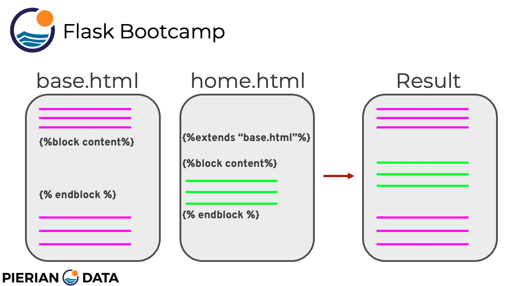

# Flask Guide

These are my personal notes and examples on how to work with Flask for web development.

I created this repository following online tutorials and the Udemy course by José Portilla [Python and Flask Bootcamp: Create Websites using Flask](https://www.udemy.com/course/python-and-flask-bootcamp-create-websites-using-flask).

Note that Python knowledge and some web development skills are required. For the latter, have a look at [jekyll_web_guide](https://github.com/mxagar/jekyll_web_guide) `/ html_css_bootstrap_guide.md`.

Mikel Sagardia, 2022.  
No guarantees.

### Table of Contents

1. [Flask Basics](#Flask-Basics)
    - Hello World Example
    - Basic Routes
    - Dynamic Routes
    - Debug Mode
2. [Templates](#Templates)
    - Basic Template
    - Template Variables with Jinja
    - Template Control Flow with Jinja
    - Template Inheritance and Filters
        - Inheritance
        - Filters
        - `url_for()`
        - Example
    - Template Forms, Catching Field Values and Error Pages
3. [Forms](#Forms)
4. SQL Databases
5. Large Applications
6. User Authentication
7. REST APIs
8. Deployment

There is an `examples/` folder with the examples described in the current guide.

# 1. Flask Basics

Installation:

```bash
# Select environment
conda activate ds
# Install if not done yet
conda install -c anaconda flask  -y
conda install -c anaconda flask-wtf  -y
```

## Hello World Example

`./examples/01_basics/hello_world.py`:

```python
from flask import Flask
app = Flask(__name__) # __name__ is __main__

# We pass to the instantiated Flask app
# the pages we want in the rout we like
# Here: an index page or view function located in the root
@app.route('/')
def index():
	# In this case, we directly return HTML code
    return '<h1>Hello World!</h1>'

if __name__ == '__main__':
    app.run()

```

To run it:

```bash
cd examples/
python hello_world.py
# Open browser at http://127.0.0.1:5000/
# To finish web server: Ctrl+C
```

## Basic Routes

With `@app.route()` we define the name of the page we are creating:

```python
@app.route('/some_page') # http://127.0.0.1:5000/some_page
def index():
	return '<h1>Hello World!</h1>'
# We create:
# http://127.0.0.1:5000/some_page
# When deployed, the DNS is changed:
# http://my_domain.com/some_page

# We can create as many pages we want.
@app.route('/information') # http://127.0.0.1:5000/information
def info():
	return '<h1>Important info: ...</h1>'

# If we try to access a page that doesn't exist
# we get a 404 error: Not found
```

## Dynamic Routes

With dynamic routes we pass variables to the page or view functions. The effect is that we can type the matching URL address we want, i.e., we pass the variable name through the browser. Then, that variable is caught by the page or view function and it can process it as desired.

One possible application are custom user pages:

`./examples/01_basics/dynamic_route.py`

```python
from flask import Flask
app = Flask(__name__)

# Main page
@app.route('/') # http://127.0.0.1:5000
def index():
    return '<h1>Hello World!</h1>'

# We can add as many pages we want with route.
@app.route('/information') # http://127.0.0.1:5000/information
def info():
    return '<h1>About page</h1>'

# Dynamic routing: we pass a variable that changes the URL name
# The idea is that the page is created when we enter the address,
# i.e., we pass the variable via the web browser!
# Then, that variable can be processed in the page or view function.
# http://127.0.0.1:5000/user/mikel -> URL accepted and content modified
# http://127.0.0.1:5000/user/unai -> URL accepted and content modified
# We can apply changes to name: name.upper(), etc.
@app.route('/user/<name>') 
def puppy(name):
    # Page for an individual puppy.
    return '<h1>This is a page for {}<h1>'.format(name.upper())

if __name__ == '__main__':
    app.run()

```

```bash
cd examples/
python dynamic_route.py
# Open browser at http://127.0.0.1:5000/
# http://127.0.0.1:5000/information
# http://127.0.0.1:5000/user/mikel -> check that content is modified with MIKEL
# To finish web server: Ctrl+C
```

## Debug Mode

We can activate debug mode in the application as follows:

```python
if __name__ == '__main__':
    app.run(debug=True)
```

That way, if we have an error in any of the page or view functions, instead of displaying an "Internal Server Error" page, we get a traceback list of all the steps until the first error.

We can also open an interactive python debugging console clicking on the traceback step icon for that; but **we need a PIN**. The PIN is displayed on the terminal/shell when we run the python script.

NOTE: debug mode should be deactivated when we deploy to production!


# 2. Templates

Instead of returning HTML strings, we usually render a template HTML file. These are **templates** and they are rendered with the function `render_template(html_filepath)`.

Templates need to be located in a folder called `templates/` and they can use resources from other locations, e.g., image files.

## Basic Template

All the HTML template files need to be in `templates/`. The resources they use can be anywhere, e.g., in this case, they are in the folder `static/`.

Basic example in `./examples/02_templates`.

`templates/basic-template.html`:

```html
<!DOCTYPE html>
<html>
  <head>
    <meta charset="utf-8">
    <title>Basic</title>
  </head>
  <body>
    <h1>Hello!</h1>
    <h2>Here is a cute picture of a puppy!</h2>
    <!-- The image can be located anywhere, but the HTML file in templates/-->
    

  </body>
</html>

```

`basic_template.py`:

```python
# Run: python basic_template.py

# Import the render_template function
from flask import Flask, render_template
app = Flask(__name__)

# Render an HTML template file
# All templates are located in the folder templates (Flask looks for that name)
# This template uses an image in the folder static
# The folder name with the resources is arbitrary
@app.route('/')
def index():
    # Connecting to a template (html file)
    return render_template('basic-template.html')

# Debug mode active; deactivate to go to production
if __name__ == '__main__':
    app.run(debug=True)

```

## Template Variables with Jinja

We can use [Jinja templating](https://jinja.palletsprojects.com/en/3.1.x/), as in Jekyll, to inject variables from the python script in the HTML document visualized with `render_template()`; simply, the variables are created inside the page/view function and passed directly to `render_template()`. Then, we access them with Jinja notation in the HTML document. We can pass strings, lists, dictionaries, etc.

Jinja command lines are of 3 types:

- `{{ ... }}`: variables and filters
- ``: control flow
- `{# ... #}`: comments

Basic example in `./examples/02_templates`.

`variables.py`

```python
# Run: python variables.py

from flask import Flask, render_template
app = Flask(__name__)

@app.route('/')
def index():
    # Pass in a puppy name
    # We insert it to the html with jinja2 templates!
    return '<h1> Go to /puppy/name </h1>'

@app.route('/puppy/<name>')
def adv_puppy_name(name):
    # Pass in a puppy name
    # We insert it to the html with Jinja templates!
    message = "Trying variables."
    letters = list(name)
    pup_dict = {'pup_name':name}
    return render_template('variables-template.html',
                           message=message,
                           name=name,
                           mylist=letters,
                           mydict=pup_dict)

if __name__ == '__main__':
    app.run(debug=True)
```

`templates/variables-template.html`:

```html
<!DOCTYPE html>
<html>
  <head>
    <meta charset="utf-8">
    <title>Basic</title>
  </head>
  <body>
    <!-- The message is defined in render_template() and passed to the HTML -->
    <h1>{{message}}</h1>
    <!-- name is passed via the browser to the python script and from there to he HTML via render_template() -->
    <h1>Basic variable insert: {{name}}!</h1>
    <!-- Recall that we set mylist=letters in the .py file. -->
    <!-- You could use whatever variable names you want -->
    <h1>List example: {{mylist}}</h1>
    <!-- We can index the list as well -->
    <h1>Indexing the list for the first letter: {{mylist[0]}}</h1>
    <!-- We can also use dictionaries -->
    <h1>Puppy name from dictionary: {{mydict['pup_name']}}</h1>
  </body>
</html>
```

## Template Control Flow with Jinja

While with Jinja variables we use `{{ variable }}` within the HTML text, we need to use `` for control flow statements, i.e., `if, for`, etc. Inside them, we can access the variables.

Examples:

```html
<ul>
    
    <li>{{ item }}</li>
    
</ul>


    <h1>Insert credit card number.</h1>

    <h1>Ask your parents.</h1>

    <h1>You're not authenticated.</h1>

```

Example in the `examples/` folder:

`control_flow.py`:

```python
# Run: python control_flow.py

from flask import Flask, render_template
app = Flask(__name__)

@app.route('/')
def index():
    puppies = ['Fluffy','Rufus','Spike']
    return render_template('control-flow-template.html',
                           puppies=puppies)

if __name__ == '__main__':
    app.run(debug=True)
```

`templates/control-flow-template.html`:

```html
<!DOCTYPE html>
<html>
  <head>
    <meta charset="utf-8">
    <title></title>
  </head>
  <body>
    <p>Here we use a for loop for a list</p>
    <ul>
      
      <li>{{pup}}</li>
      
    </ul>
    <p>We can also add if/else statements:</p>
    
      <p>Found you in the list of puppies Rufus!</p>
    
      <p>Hmm, Rufus isn't in this list.</p>
    
  </body>
</html>
```

## Template Inheritance and Filters

### Inheritance

The idea is to define a base HTML template file which is inherited by other HTML files. That way, we don't need to repeat ourselves with common elements like styles, menu bars, etc.

This is accomplished with `` and ``:

- We set ` ` in the base HTML where the concrete content would go in the inherited page.
- The inherited page contains `` and after it its concrete content wrapped in ` CONTENT `.

Note that the name of the block `content` is arbitrary, but must match between the files; additionally, we can use several blocks.



### Filters

Filtering consists in applying functions to variables; often these function names are similar to the ones in python:

```
{{ variable | filter }}
{{ name | capitalize }}
```

We could perform these actions in python, but we have the flexibility of doing it on the HTML code.

Important links on filter:

- [Template Designer Documentation](https://jinja.palletsprojects.com/en/3.1.x/templates/)
- [List of built-in filters](https://jinja.palletsprojects.com/en/3.1.x/templates/#builtin-filters)

### `url_for()`

Instead of using hard-coded HTML filepaths we can use `url_for()` in a Jinja command: we enter the page or view function name and the associated HTML file path is returned.

For instance, if we have this python app:

```python
from flask import Flask, render_template
app = Flask(__name__)

@app.route('/')
def about_page_function():
    return render_template('/path/to/about.html')
```

Then, in any HTML file we have access to the complete `about.html` file path via its **page/view function name**:

```html
{{ url_for('about_page_function') }}
```

We can also access any asset or file, not only HTML files. In that case, we specify the folder name and the file name:

```html
{{ url_for('static', filename='pic.jpg') }}
```

### Example

This example is in `examples/02_templates/`.

Notes:

- The consists of 1 python file and 3 HTML files; one HTML is the base which is inherited.
- Variable filtering is used: `{{ name | capitalize }}`
- We use `url_for()` to get an HTML filepath and a pic filepath.

```python
# Run: python inheritance.py

from flask import Flask, render_template
app = Flask(__name__)

# Home page
# The HTML file inherits from inheritance-base.html
# which contains a common Bootstrap nav-bar
@app.route('/')
def index():
    return render_template('inheritance-home.html')

# Puppy name page
# The HTML file inherits from inheritance-base.html
# which contains a common Bootstrap nav-bar
@app.route('/puppy/<name>')
def pup_name(name):
    return render_template('inheritance-puppy.html',name=name)

if __name__ == '__main__':
    app.run(debug=True)
```

```html
<!-- inheritance-base.html -->

<!DOCTYPE html>
<html>
  <head>
    <meta charset="utf-8">
    <title>Puppy Rock</title>
    <link rel="stylesheet" href="https://maxcdn.bootstrapcdn.com/bootstrap/4.0.0/css/bootstrap.min.css" integrity="sha384-Gn5384xqQ1aoWXA+058RXPxPg6fy4IWvTNh0E263XmFcJlSAwiGgFAW/dAiS6JXm" crossorigin="anonymous">
    <script src="https://maxcdn.bootstrapcdn.com/bootstrap/4.0.0/js/bootstrap.min.js" integrity="sha384-JZR6Spejh4U02d8jOt6vLEHfe/JQGiRRSQQxSfFWpi1MquVdAyjUar5+76PVCmYl" crossorigin="anonymous"></script>
  </head>
  <body>
    <nav class="navbar navbar-expand-lg navbar-light bg-light">
      <a class="navbar-brand" href="{{ url_for('index') }}">Puppies Rock!</a>
    </nav>
    
    
  </body>
</html>

<!-- inheritance-home.html -->



<h1>This is the home page.</h1>
<h2>Go to /puppy/name</h2>


<!-- inheritance-puppy.html -->



<h1>This is the page for the puppy: {{ name | capitalize }}.</h1>
<a href="{{ url_for('static',filename='puppy_pic.jpg') }}">Click here for a picture of {{ name | capitalize }}.</a> 


```

## Template Forms, Catching Field Values and Error Pages

In this section, a website with several pages is created; they direct to a sign-up form defined in HTML, and formatted with the Bootstrap CSS stylesheet. After signing up, a thank you page with the signed name is shown. However, that information is not saved anywhere.

New learned things:

- How to get values of fields filled into a form with `request`. We can access what the user inserts in `input` fields like `<input type="text" name="first">` from anywhere in the python script using the name of the field
- Error page: basically a custom page is defined with the decorator `@app.errorhandler(404)`.

The example is in `examples/02_temaplates`.

```python
# Run: python form.py

# Note we imported request!
from flask import Flask, render_template, request
app = Flask(__name__)

@app.route('/')
def index():
    return render_template('form-index.html')

# This page will have the sign up form.
# The user inserts values into form fields.
# These values are accessible via request.args.get(),
# as shown in the next page/view function.
# However, note that in this example we do not persist the values.
@app.route('/signup_form')
def signup_form():
    return render_template('form-sign-up.html')

# This page will be the page after the form
@app.route('/thankyou')
def thank_you():
    # We can access what the user inserts in `input` fields like
    # `<input type="text" name="first">`
    # from anywhere in the python script using the name of the field
    first = request.args.get('first')
    last = request.args.get('last')
    return render_template('form-thankyou.html',first=first,last=last)

@app.errorhandler(404)
def page_not_found(e):
    return render_template('form-404.html'), 404

if __name__ == '__main__':
    app.run(debug=True)

```

```html
<!-- form-base.html -->

<!DOCTYPE html>
<html>
  <head>
    <meta charset="utf-8">
    <title>Puppy Rock</title>
    <link rel="stylesheet" href="https://maxcdn.bootstrapcdn.com/bootstrap/4.0.0/css/bootstrap.min.css" integrity="sha384-Gn5384xqQ1aoWXA+058RXPxPg6fy4IWvTNh0E263XmFcJlSAwiGgFAW/dAiS6JXm" crossorigin="anonymous">
    <script src="https://maxcdn.bootstrapcdn.com/bootstrap/4.0.0/js/bootstrap.min.js" integrity="sha384-JZR6Spejh4U02d8jOt6vLEHfe/JQGiRRSQQxSfFWpi1MquVdAyjUar5+76PVCmYl" crossorigin="anonymous"></script>
  </head>
  <body>
    <nav class="navbar navbar-expand-lg navbar-light bg-light">
      <a class="navbar-brand" href="{{url_for('index')}}">Home Page</a>
    </nav>
    
    
  </body>
</html>

<!-- form-index.html -->



<div class="jumbotron">
<p>Welcome to Puppy Rock!</p>
<p>Wanna sign up for our puppy band?</p>
<a href="{{url_for('signup_form')}}">Sign up for auditions here</a>
</div>


<!-- form-sign-up.html -->



<div class="jumbotron">
    <h1>Welcome to the sign up page!</h1>
    <p>We're excited to have you audition for our band</p>
    <p>This will redirect to a thank you page.</p>
    <p>
      Please note, we're just puppies, so we haven't
      learned how to save your information yet!
    </p>
    <form action="{{url_for('thank_you')}}">
        <label for="first">First Name</label>
        <input type="text" name="first">
        <label for="last">Last Name</label>
        <input type="text" name="last">
        <input type="submit" value="Submit Form">
    </form>
</div>


<!-- form-thankyou.html -->



<div class="jumbotron">

  <h1>Thank you for signing up {{first}} {{last}}!</h1>
</div>


<!-- form-404.html -->



<div class="jumbotron">
<p>Sorry, we couldn't find the page you were looking for.</p>
<p>Cut us some slack, we're just puppies!</p>
</div>


```

# 3. Forms

The previous section introduced a very basic interaction with a form using `request`. However, the form was defined on the HTML side only, not on the Flask side. If we define forms in Flask and reference them in the HTML, we can do much more powerful things.

This section shows to do that.

Concretely, the following technical tools are used:

- Forms are defined in HTML with `<form>`.
- [WTForms](https://wtforms.readthedocs.io/en/3.0.x/) are used: *"WTForms is a flexible forms validation and rendering library for Python web development. It can work with whatever web framework and template engine you choose. It supports data validation, CSRF protection, internationalization (I18N), and more. There are various community libraries that provide closer integration with popular frameworks."*
- Flask forms are used in combination with WTForms: [Flask-WTF](https://flask-wtf.readthedocs.io/en/1.0.x/): *"Simple integration of Flask and WTForms, including CSRF, file upload, and reCAPTCHA."*.

The examples are in the folder `examples/03_forms/`.

## First Basic Example

A Flask-WTF form is defined in python and connected to the HTML file so that we can validate and read the fields as well as set their value.

Very basic but interesting example.

Notes:

- The form class definition and the app are in the same python script. In larger applications, usually we separate both: the form class(es) are defined outside and the imported.
- The HTML `<form>` doesn't need a `class` or an `action`, because we use directly WTForms.
- If we want some styling, we can append `(class='some CSS class')` to an element in the HTML file: `form.food_choice(class='some CSS class')`.

`examples/03_forms/basic_form.py`:

```python
# Run: python basic_form.py

from flask import Flask, render_template
from flask_wtf import FlaskForm
from wtforms import StringField, SubmitField

app = Flask(__name__)

# Configure a secret SECRET_KEY in the app config dictionary.
# Here, we do it explicitly in the code for learning
# but we NEVER should do that.
# An alternative is to define it as an environment variable
# and to catch it: os.environ['VARIABLE']
app.config['SECRET_KEY'] = 'mysecretkey'

# Now create a WTForm Class
# Lots of fields available:
# https://wtforms.readthedocs.io/en/3.0.x/fields/
class InfoForm(FlaskForm):
    '''This general class gets a lot of form about puppies.
    Mainly a way to go through many of the WTForms Fields.
    '''
    breed = StringField('What breed are you?')
    submit = SubmitField('Submit')

# We need to pass the methods GET and POST
# to interact with the HTML form from python
@app.route('/', methods=['GET', 'POST'])
def index():
    # Set the breed to a boolean False
    # so we can use it in an if statement in the HTML.
    breed = False
    # Create instance of the form.
    form = InfoForm()
    # If the form is valid on submission (see validation next)
    if form.validate_on_submit():
        # Grab the data from the breed on the form: GET
        # Note the notation: form.<field>.data
        breed = form.breed.data
        # Reset the form's breed data to be False: POST
        form.breed.data = ''
    # We need to pass all the objects we interact with
    return render_template('basic-home.html', form=form, breed=breed)

if __name__ == '__main__':
    app.run(debug=True)

```

`examples/03_forms/templates/basic-home.html`:

```html
<p>

  The breed you entered is {{breed}}.
  You can update it in the form below:

  Please enter your breed in the form below:

</p>

<form method="POST">
    {# This hidden_tag is a CSRF security feature (CSRF = Cross-site request forgery). #}
    {# The HTML <form> doesn't need a class or an action, because we use directly WTForms. #}
    {# If we want some styling, we append (class='some CSS class') to an element. #}
    {{ form.hidden_tag() }}
    {{ form.breed.label }} {{ form.breed(class='some-css-class') }}
    {{ form.submit() }}
</form>

```

## Forms Fields

Basically any HTML form field has its Flask-WTForm equivalent object. This section shows an example in which a form with several field types needs to be filled. After hitting the submit button, the content is validated and retrieved to python; then, it is displayed in a "thank you" page.

This example extends the previous as follows:

- Several field types are used.
- The dictionary `session` is used to save data in a session for the whole application. This object is special because we don't need to pass it: it's visible everywhere.
- Validation is done.
- Redirection is used.

`examples/03_forms/form_fields.py`:

```python
# Run: python form_fields.py

# The session dictionary makes possible to store information
# visible to the whole application while the user is interacting in a session 
from flask import Flask, render_template, session, redirect, url_for, session
from flask_wtf import FlaskForm
# We can import many fields, there's one for each HTML form component
from wtforms import (StringField, BooleanField, DateTimeField,
                     RadioField, SelectField, TextField,
                     TextAreaField, SubmitField)
# We can import field validators too!
from wtforms.validators import DataRequired

app = Flask(__name__)
# Configure a secret SECRET_KEY in the app config dictionary.
# Here, we do it explicitly in the code for learning
# but we NEVER should do that.
# An alternative is to define it as an environment variable
# and to catch it: os.environ['VARIABLE']
app.config['SECRET_KEY'] = 'mysecretkey'

# Now create a WTForm Class
# Lots of fields available:
# https://wtforms.readthedocs.io/en/3.0.x/fields/
class InfoForm(FlaskForm):
    '''This general class gets a lot of form about puppies.
    Mainly a way to go through many of the WTForms Fields.
    '''
    # We can pass the validators of a field we'd like
    breed = StringField('What breed are you?',validators=[DataRequired()])
    neutered  = BooleanField("Have you been neutered?")
    # Every time we define dictionaries or tuples in the field definition
    # the user sees the value (Happy), but we get the key (mood_one).
    mood = RadioField('Please choose your mood:',
                      choices=[('mood_one','Happy'),('mood_two','Excited')])
    # In some OS we need unicode strings for field selection, thus we use u
    food_choice = SelectField(u'Pick Your Favorite Food:',
                              choices=[('chi', 'Chicken'),
                                       ('bf', 'Beef'),
                                       ('fish', 'Fish')])
    feedback = TextAreaField()
    submit = SubmitField('Submit')

# We define the methods GET and POST
# so that we can read/write from fields
@app.route('/', methods=['GET', 'POST'])
def index():
    # Create instance of the form.
    form = InfoForm()
    # If the form is valid on submission (we'll talk about validation next)
    if form.validate_on_submit():
        # Grab the data from the breed on the form.
        # We use the session dictionary, which lives on the server
        # and is accessible for the complete application
        # while the user is interacting with the form/page in a session,
        # then it's reset.
        # We can extend the session dictionary with our desired fields.
        # Recall the notation: form.<field>.data
        session['breed'] = form.breed.data
        session['neutered'] = form.neutered.data
        session['mood'] = form.mood.data
        session['food'] = form.food_choice.data
        session['feedback'] = form.feedback.data

        # When form correctly filled in, show thank you page
        return redirect(url_for('thankyou'))

    # Original return to show unfilled form
    return render_template('fields-home.html', form=form)

@app.route('/thankyou')
def thankyou():
    return render_template('fields-thankyou.html')

if __name__ == '__main__':
    app.run(debug=True)

```

`examples/03_forms/templates/`:

```html
<!-- fields-home.html -->

<h1>Welcome to Puppy Surveys</h1>
<form  method="POST">
    {# This hidden_tag is a CSRF security feature. #}
    {# The HTML <form> doesn't need a class or an action, because we use directly WTForms. #}
    {# If we want some styling, we append (class='some CSS class') to an element: #}
    {# form.food_choice(class='some CSS class') #}

    {{ form.hidden_tag() }}
    {{ form.breed.label }} {{ form.breed }}
    <br>
    {{ form.neutered.label }} {{ form.neutered }}
    <br>
    {{ form.food_choice.label }}{{ form.food_choice }}
    <br>
    {{ form.mood.label }}{{ form.mood }}
    <br>
    Any other feedback?
    <br>
    {{ form.feedback }}
   <br>
    {{ form.submit() }}
</form>

<!-- fields-thankyou.html -->

<h1>Thank you. Here is the info you gave:</h1>
<ul>
  {# The session dictionary is always visible, no need to pass it. #}
  <li>Breed: {{session['breed']}}</li>
  <li>Neutered: {{session['neutered']}}</li>
  {# Note, this saves the mood key, not the form value! #}
  <li>Mood: {{session['mood']}}</li>
  <li>Food: {{session['food']}}</li>
  <li>Feedback: {{session['feedback']}}</li>
</ul>


```

## Flash Alerts

Often, when the user fills in a form, instead redirecting to a thank you message, we display a banner.
That can be done with the `flash` alert object in Flask.

In order to display a nice flash alert object we can use Bootstrap.

`examples/03_forms/flash.py`:

```python
# Run: python flash.py

from flask import Flask, render_template, flash, session, redirect, url_for
from flask_wtf import FlaskForm
from wtforms import StringField,SubmitField

app = Flask(__name__)
# Configure a secret SECRET_KEY in the app config dictionary.
# Here, we do it explicitly in the code for learning
# but we NEVER should do that.
# An alternative is to define it as an environment variable
# and to catch it: os.environ['VARIABLE']
app.config['SECRET_KEY'] = 'mysecretkey'

# Now create a WTForm Class
# Lots of fields available:
# https://wtforms.readthedocs.io/en/3.0.x/fields/
class SimpleForm(FlaskForm):
    # The form has just one button
    submit = SubmitField('Click Me.')

@app.route('/', methods=['GET', 'POST'])
def index():
    form = SimpleForm()

    if form.validate_on_submit():
        # This is the flash alert message
        flash("You just clicked the button!")

        # We redirect here, but the flash alert has been instantiated
        return redirect(url_for('index'))

    return render_template('flash-home.html', form=form)

if __name__ == '__main__':
    app.run(debug=True)

```

`examples/03_forms/templates/flash-home.html`:

```html
<!DOCTYPE html>
<html>
<head>
  <meta charset="utf-8">
  <meta name="viewport" content="width=device-width, initial-scale=1">
  <title></title>
  <link rel="stylesheet" href="https://maxcdn.bootstrapcdn.com/bootstrap/4.0.0/css/bootstrap.min.css" integrity="sha384-Gn5384xqQ1aoWXA+058RXPxPg6fy4IWvTNh0E263XmFcJlSAwiGgFAW/dAiS6JXm" crossorigin="anonymous">
  <script src="https://code.jquery.com/jquery-3.2.1.slim.min.js" integrity="sha384-KJ3o2DKtIkvYIK3UENzmM7KCkRr/rE9/Qpg6aAZGJwFDMVNA/GpGFF93hXpG5KkN" crossorigin="anonymous"></script>
  <script src="https://cdnjs.cloudflare.com/ajax/libs/popper.js/1.12.9/umd/popper.min.js" integrity="sha384-ApNbgh9B+Y1QKtv3Rn7W3mgPxhU9K/ScQsAP7hUibX39j7fakFPskvXusvfa0b4Q" crossorigin="anonymous"></script>
  <script src="https://maxcdn.bootstrapcdn.com/bootstrap/4.0.0/js/bootstrap.min.js" integrity="sha384-JZR6Spejh4U02d8jOt6vLEHfe/JQGiRRSQQxSfFWpi1MquVdAyjUar5+76PVCmYl" crossorigin="anonymous"></script>
</head>
<body>
  
  {# Source for this bootstrapcode:
  https://getbootstrap.com/docs/4.0/components/alerts/#dismissing #}
  <div class="container">

    {# get_flashed_messages() is auto sent to the template with the flash() call #}
    {# we use a loop in case we sent/called flash() several times #}
        
        <div class="alert alert-warning alert-dismissible fade show" role="alert">
          <button type="button" class="close" data-dismiss="alert" aria-label="Close" class="fade close">
            <span aria-hidden="true">&times;</span>
          </button>
          {{mess}}
          </div>
        

    <form method="POST">
        {# This hidden_tag is a CSRF security feature. #}
        {{ form.hidden_tag() }}
        {{ form.submit() }}
    </form>

  </div>
</body>
</html>

```

# 4. SQL Databases

If want to persist the information that is generate in the application or access some data required by the application, we need a database. Usually Relational Databases are used, i.e., we can interface them SQL.

In this section, the following tools are used:

- SQLite for the database handling; it scales very well. It comes with Flask already installed.
- SQLAlchemy to interface with the database using python; instead of SQL statements, we can just use python commands with SQLAlchemy. SQLAlchemy is an Object-Relational Mapper (ORM) which links SQL databases with python interfaces.

In order to install SQLAlchemy and database migration capabilities:

```bash
conda activate ds
pip install Flask-SQLAlchemy
pip install Flask-Migrate
```

The examples related to this section are in the folder `examples/04_sql_databases/`. Each section has a sub-folder.

## Setting Up a Database and Basic CRUD Operations with It

In this section, we are going to do the following:

- Set up an SQLite database in a Flask app. This is done with few lines of cone inside the Flask app; we basically instantiate a SQLite database with SQLAlchemy.
- Create a model in a Flask app. A model links to a table in a SQL database. Thanks to the SQLAlchemy abstractions, we simply instantiate a model class without any SQL; the model is a table in the SQL database.
- Perform a basic **CRUD** on our model: Create (a row), Read (a row), Update (a row), Delete (a row). Usually CRUD operations are handled automatically with Flask, but we're going to carry them out manually to see how they work.

Everything is accomplished in python scripts, without the need of any HTML code. See `examples/04_sql_databases/01_model_CRUD_basics/`:

- `basic_model_app.py`: the database `db` is defined within a Flask app and a table is defined for it: `Puppy`.
- `set_up_database.py`: the database is set up, i.e., the tables are created and the file is written to disk; additionally, an example row is added.
- `basic_crud.py`: create, read, update and delete operations are carried out as examples.

The database file `data.sqlite` is created when executing the files.

### `basic_model_app.py`

```python
import os
from flask import Flask
from flask_sqlalchemy import SQLAlchemy
from flask_migrate import Migrate

### -- SET UP OUR SQLite DATABASE

# This grabs our directory, OS independent
basedir = os.path.abspath(os.path.dirname(__file__))

app = Flask(__name__)

# Connect our Flask App to our Database.
# We specify the file in which the database is saved.
app.config['SQLALCHEMY_DATABASE_URI'] = 'sqlite:///' + os.path.join(basedir, 'data.sqlite')
# We can track all the modifications done to the database
# but we deactivate it.
app.config['SQLALCHEMY_TRACK_MODIFICATIONS'] = False

# db is the database, which knows the Flask app
# using db we create models/tables to it,
# which are composed by rows.
db = SQLAlchemy(app)

# Add on migration capabilities in order to run terminal commands
Migrate(app,db)

# Let's create our first model!
# We inherit from db.Model class
class Puppy(db.Model):

    # If you don't provide this, the default table name will be the class name
    __tablename__ = 'puppies'

    # Now create the columns
    # Lots of possible types. We'll introduce through out the course
    # Full docs: http://docs.sqlalchemy.org/en/latest/core/types.html

    ### -- CREATE THE COLUMNS FOR THE TABLE

    # The columns will be: id (primary key), name, age

    # Primary Key column, unique id for each puppy
    id = db.Column(db.Integer,primary_key=True)
    # Puppy name
    name = db.Column(db.Text)
    # Puppy age in years
    age = db.Column(db.Integer)

    # This sets what an instance in this table will have, i.e., a ROW.
    # Note the id will be auto-created for us later, so we don't add it here!
    def __init__(self,name,age):
        self.name = name
        self.age = age

    def __repr__(self):
        # This is the string representation of a puppy in the model
        # I.e., when we want to print a ROW.
        return f"Puppy {self.name} is {self.age} years old."
```

### `set_up_database.py`

```python
# This is a very simple script that will show you how to setup our DB
# Later on we'll want to use this type of code with templates

### NOTE!! If you run this script multiple times you will add
### multiple puppies to the database. That is okay, just the
### ids will be higher than 1, 2 on the subsequent runs

# Import database info
from basic_model_app import db, Puppy

# Create the tables in the database
# db was instantiated in basic_model_app
# The SQLite database file appears in its path 
# (Usually won't do it this way!)
db.create_all()

# Create new entries in the database
sam = Puppy('Sammy',3)
frank = Puppy('Frankie',4)

# Check ids
# We haven't added sam and frank to database, so they should be None.
# Note that id is the primary key, set when creating a columns
print(sam.id)
print(frank.id)

# Ids will get created automatically once we add these entries to the DB
# Note we use session: db.session
db.session.add_all([sam,frank])

# Alternative for individual additions:
# db.session.add(sam)
# db.session.add(frank)

# Now save it to the database
db.session.commit()

# Check the ids
# Now we get the ids
print(sam.id)
print(frank.id)

```

### `basic_crud.py`

```python
# Now that the table has been created by running: set_up_database.py
# basic_model_app and set_up_database we can play around with CRUD commands
# This is just an overview, usually we won't run a single script like this
# Our goal here is to just familiarize ourselves with CRUD commands

from basic_model_app import db, Puppy

### -- CREATE

my_puppy = Puppy('Rufus',5)
db.session.add(my_puppy)
db.session.commit()

### -- READ

# Note lots of ORM filter options here.
# Basically, SQL statements are translated into python calls:
# filter(), filter_by(), limit(), order_by(), group_by()
# Also lots of executor options:
# all(), first(), get(), count(), paginate()

all_puppies = Puppy.query.all() # list of all puppies in table
print(all_puppies) # [Puppy Sammy is 3 years old., Puppy Frankie is 4 years old., Puppy Rufus is 5 years old.]
print('\n')
# Grab by id
puppy_one = Puppy.query.get(1)
print(puppy_one) # Puppy Sammy is 3 years old.
print(puppy_one.age) # 3
print('\n')
# Filters, e.g., by column values (column name)
puppy_sam = Puppy.query.filter_by(name='Sammy') # Returns list
print(puppy_sam) # Sammy is 3 years old.
print('\n')

### -- UPDATE 

# Grab your data, then modify it, then save the changes.
first_puppy = Puppy.query.get(1)
first_puppy.age = 10
db.session.add(first_puppy)
db.session.commit()

### -- DELETE

second_pup = Puppy.query.get(2)
db.session.delete(second_pup) # error if second_pup doesn't exist
db.session.commit()

# Check for changes:
all_puppies = Puppy.query.all() # list of all puppies in table
print(all_puppies) # [Puppy Sammy is 10 years old., Puppy Rufus is 5 years old.]
```

## Flask Migrate

Whenever we redefine or modify tables of a database with SQLAlchemy as python models or classes we need to migrate those changes to the SQLite database. This migration is not automatic, it needs to be done whenever we change the table/model class, for instance, if we add a new field/column.

To do that, we need to have active the migration capabilities of the database in the python script where it is defined:

```python
from flask_migrate import Migrate

# ...
db = SQLAlchemy(app)

# Add on migration capabilities in order to run terminal commands
Migrate(app,db)

# Model/Table
class MyTable(db.Model):
    #...
```

Additionally, we need to set the Flask application file to the environment variable `FLASK_APP` and initialize the migrations repository:

```bash
# Set FLASK_APP environment variable
# Unix
export FLASK_APP=basic_model_app.py
# Windows
set FLASK_APP=basic_model_app.py

# Create migration repository; execute only once
flask db init # migrations folder is created

# To set the migrations for the first time
# we need to run this migration command.
# Subsequent changes are also migrated this way
flask db migrate -m "created Puppies table"

# Now, we execute the migration: we upgrade the table
flask db upgrade
```

After that, let's say we change our table from `basic_model_app.py` by adding a column/field `breed`:

```python
class Puppy(db.Model):
    '''Puppy table in database. It contains puppies with their attributes.'''
    __tablename__ = 'puppies'

    id = db.Column(db.Integer,primary_key=True)
    name = db.Column(db.Text)
    age = db.Column(db.Integer)
    # new
    breed = db.Column(db.Text)

    def __init__(self,name,age,breed='Unknown'):
        self.name = name
        self.age = age
        # new
        self.breed = breed

    def __repr__(self):
        return f"Puppy {self.name} is {self.age} years old."
```

Then, in order to migrate those changes, we need to execute these commands in the directory where the `basic_model_app.py` table definition class is:

```bash
# Every time we change the table(s) in the app basic_model_app.py
# we need to run this migration command;
# it defines the migration in the repository
flask db migrate -m "added breed column"

# Now, we execute the migration: we upgrade the table
flask db upgrade
```

## Flask Relationships

We want to have several models/tables which are related; to that end, we create several of them and define primary and foreign key, as in SQL:

- A primary key in a table is a unique identifier.
- A foreign key in a table represents a primary key from another tables, such that both rows in different tables are linked or connected.

Additionally, we need to tell our app how the models/tables are connected, thus we define `db.relationships`: these are the necessary objects in the app to link models and facilitate join operations later on. Moreover, if we add `backrefs` to the relationships, given an object, we can access its linked object's columns.

All this is exemplified in `examples/04_sql_databases/02_relationships`.

File `models.py`:

```python
import os
from flask import Flask
from flask_sqlalchemy import SQLAlchemy
from flask_migrate import Migrate

### -- Set up SQL database

# This grabs our directory
basedir = os.path.abspath(os.path.dirname(__file__))

app = Flask(__name__)

# Connects our Flask App to our Database
app.config['SQLALCHEMY_DATABASE_URI'] = 'sqlite:///' + os.path.join(basedir, 'data.sqlite')
app.config['SQLALCHEMY_TRACK_MODIFICATIONS'] = False

db = SQLAlchemy(app)
Migrate(app,db)

class Puppy(db.Model):

    __tablename__ = 'puppies'

    id = db.Column(db.Integer,primary_key = True)
    name = db.Column(db.Text)
    # This is a one-to-many relationship
    # The parameter uselist=True is default, so by default we have one-to-many.    
    # A puppy can have many toys.
    # 'Toy': class name of the table we're connecting to
    # backref: back-reference added in the Toy model; we set the current class name in lower
    # lazy: it specifies how the related items are to be loaded, dynamic is the general purpose approach
    toys = db.relationship('Toy',backref='puppy',lazy='dynamic')
    # This is a one-to-one relationship
    # A puppy only has one owner, thus uselist is False (default is True).
    # Strong assumption of 1 dog per 1 owner and vice versa.
    # The parameter uselist=False makes 1-to-1
    # We can still use lazy='dynamic'
    owner = db.relationship('Owner',backref='puppy',uselist=False)

    def __init__(self,name):
        # Note how a puppy only needs to be initalized with a name!
        self.name = name

    def __repr__(self):
        if self.owner:
            return f"Puppy name is {self.name} and owner is {self.owner.name}"
        else:
            return f"Puppy name is {self.name} and has no owner assigned yet."

    def report_toys(self):
        print("Here are my toys!")
        for toy in self.toys:
            print(toy.item_name)
        

class Toy(db.Model):

    __tablename__ = 'toys'

    id = db.Column(db.Integer,primary_key = True)
    item_name = db.Column(db.Text)
    # Connect the toy to the puppy that owns it.
    # We use puppies.id because __tablename__='puppies'
    puppy_id = db.Column(db.Integer,db.ForeignKey('puppies.id'))

    def __init__(self,item_name,puppy_id):
        self.item_name = item_name
        self.puppy_id = puppy_id


class Owner(db.Model):

    __tablename__ = 'owners'

    id = db.Column(db.Integer,primary_key= True)
    name = db.Column(db.Text)
    # We use puppies.id because __tablename__='puppies'
    puppy_id = db.Column(db.Integer,db.ForeignKey('puppies.id'))

    def __init__(self,name,puppy_id):
        self.name = name
        self.puppy_id = puppy_id

```

After creating `models.py`, we migrate our database for the first time:

```bash
cd examples/04_sql_databases/02_relationships
export FLASK_APP=models.py
flask db init
flask db migrate -m "initial migration"
flask db upgrade
```

Then, we can add and access entries to the database: `populate_database.py`:

```python
# Run: python populate_database.py

# This script will create some puppies, owners, and toys!
# Note, if you run this more than once, you'll be creating dogs with the same
# name and duplicate owners. The script will still work, but you'll see some
# warnings. Watch the video for the full explanation.
from models import db, Puppy, Owner, Toy

# Create 2 puppies
rufus = Puppy("Rufus")
fido = Puppy("Fido")

# Add puppies to database
db.session.add_all([rufus,fido])
db.session.commit()

# Check with a query, this prints out all the puppies!
print(Puppy.query.all())

# Grab Rufus from database
# Grab all puppies with the name "Rufus", returns a list, so index [0]
# Alternative is to use .first() instead of .all()[0]
rufus = Puppy.query.filter_by(name='Rufus').all()[0]

# Create an owner to Rufus: one-to-one
jose = Owner("Jose",rufus.id)

# Give some Toys to Rufus: one-to-many
toy1 = Toy('Chew Toy',rufus.id)
toy2 = Toy("Ball",rufus.id)

# Commit these changes to the database
# We can pass several object types because all inherit from db.Model
db.session.add_all([jose,toy1,toy2])
db.session.commit()

# Let's now grab rufus again after these additions
rufus = Puppy.query.filter_by(name='Rufus').first()
print(rufus)

# Show toys
print(rufus.report_toys())

# You can also delete things from the database:
# find_pup = Puppy.query.get(1)
# db.session.delete(find_pup)
# db.session.commit()

```

## Databases in Views/Page Functions

So far we've seen examples of databases handled outside from the page functions or views. This section puts everything together to create a web application with a database beneath.


# 5. Large Applications


# 6. User Authentication


# 7. REST APIs


# 8. Deployment


